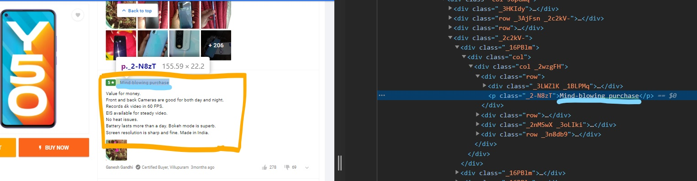

# scraper_heroku
This is a FLIPKART review scraper deployed in HEROKU,link  https://review-scraper-vk.herokuapp.com/
made using beautiful soup,flask.

**output is**

when it not works it shows **"something went wrong"** on screen then edit the class values in code

 then comments box class value
 
 
 
